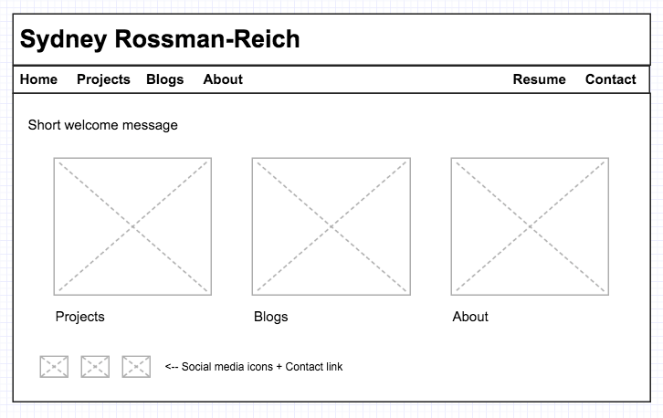
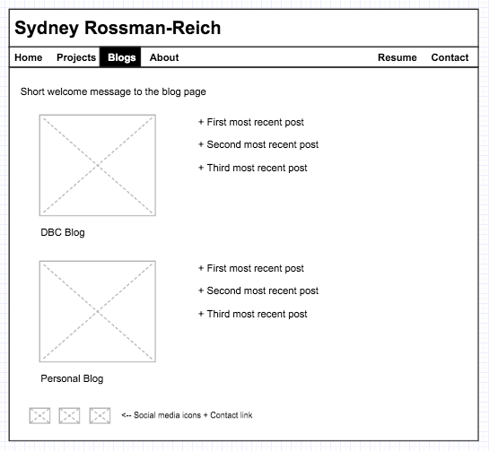

# 2.4 Wireframing

What is a wireframe?

A wireframe is a mockup of what pages in your website will look like. Designers use this to plan how they will pull a page together and to review various options for what each part of a website could look like.

What are the benefits of wireframing?

Wireframing makes it easier to visually understand how your website will look, compare options, and socialize a page before anyone actually spends energy and time building the design.

Did you enjoy wireframing your site?

It was a pretty fun exercise to imagine what my site could look like and to create a mockup for this design.

Did you revise your wireframe or stick with your first idea?

I stuck with my first idea, but imagine that this first draft may change as I am exposed to more ideas in my cohort (and beyond) and learn more about html and css.

What questions did you ask during this challenge? What resources did you find to help you answer them?

I wondered what are best practices are for personal websites like this (with projects and resume listed). I tried to lookup examples on the web but didn't find much that was interesting. This actually made me wonder too how one effectively promotes one's page once the site is launched.

Which parts of the challenge did you enjoy and which parts did you find tedious?

The actual wireframing itself on the web was a bit tedious. Next time I think I will draw the page by hand instead.