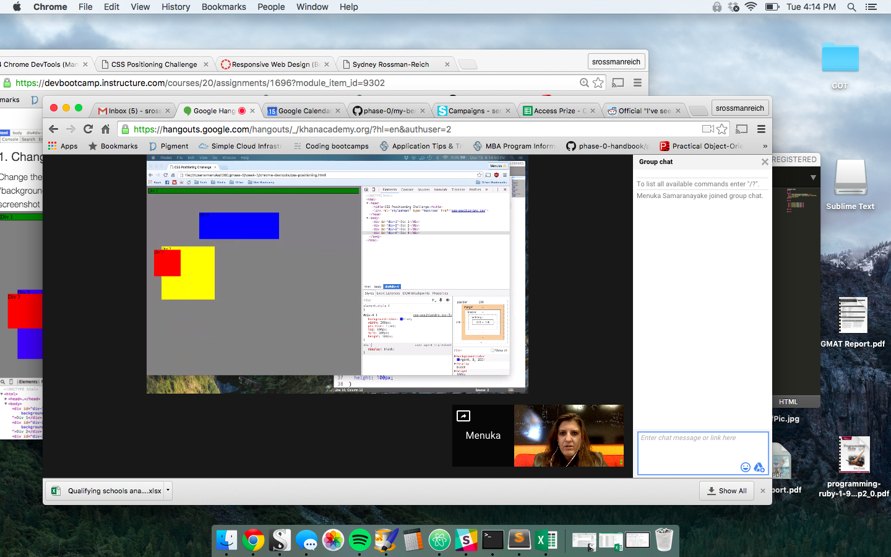

#Questions

How can you use Chrome's DevTools inspector to help you format or position elements?

Chrome DevTools can be used to practice and test css styling elements without worrying about irreparably screwing up your file.

How can you resize elements on the DOM using CSS?

By double clicking on the size elements you want to change and adding your own numbers or by simply typing in the new element you want to add.

What are the differences between absolute, fixed, static, and relative positioning? Which did you find easiest to use? Which was most difficult?

Absolute positioning positions an element relative to another, older element. This positioning at first was frustrating to use for this reason. Fixed positioning positions an element in a fixed spot on the browser. Static positiong (the default positioning) positions elements in the order they exist in the doc. Relative positioning positions the element relative to where it would otherwise be. I think relative positioning is the most confusing for me, while fixed is the easiest to understand (although maybe not the most useful.)

What are the differences between margin, border, and padding?

Padding is the area in an element between the content and its border (the outer edge of the element). The margin is the space just outside the element's border.

What was your impression of this challenge overall? (love, hate, and why?)

I thought this challenge was great and really made me a lot more comfortable with positioning elements using css.

#Screenshots

