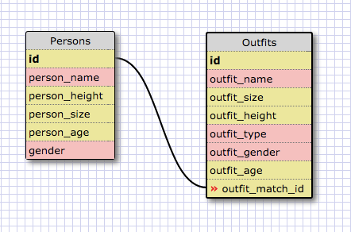

Answers to 8.4 Intro to Databases

1) Select all data for all states.

	SELECT * FROM states;

2) Select all data for all regions.

	SELECT * FROM regions;

3) Select the state_name and population for all states.

	SELECT state_name, population FROM states;

4) Select the state_name and population for all states ordered by population. The state with the highest population should be at the top.

	SELECT state_name, population FROM states ORDER BY population DESC;

5) Select the state_name for the states in region 7.

	SELECT state_name FROM states WHERE region_id = 7;

6)  Select the state_name and population_density for states with a population density over 50 ordered from least to most dense.

	SELECT state_name, population_density FROM states
	WHERE population_density > 50
	ORDER BY population_density ASC;

7) Select the state_name for states with a population between 1 million and 1.5 million people.

	SELECT state_name FROM states
	WHERE population BETWEEN 1000000 AND 1500000;

8) Select the state_name and region_id for states ordered by region in ascending order.

	SELECT state_name, region_id FROM states
	ORDER BY region_id ASC;

9) Select the region_name for the regions with "Central" in the name.

	SELECT region_name FROM regions
	WHERE region_name LIKE "%Central%";

10) Select the region_name and the state_name for all states and regions in ascending order by region_id. Refer to the region by name. (This will involve joining the tables).

	SELECT regions.region_name, states.state_name FROM regions
	INNER JOIN states
	ON states.region_id = regions.id;

CLUELESS IMAGE:

REFLECT:
What are databases for? -- Databases are used for collecting, sorting, and manipulating large quantities of connected data.
What is a one-to-many relationship? -- This is a relationship between two items where one item can be included in the other (like as its category), but the other item (again the category item) can have lots of different elements connected to / inside it.
What is a primary key? What is a foreign key? How can you determine which is which? -- The primary key is the numeric key assigned directly to every item in your database. The foreign key for that id is that same id, but used in another database (useful for connecting two databases together). You can tell if the id you're using is foreign or not based on whether the database you're in has a unique id for each item (usually than the key, not foreign key)
How can you select information out of a SQL database? -- What are some general guidelines for that? You can select information by calling the column(s) you want to select (with the SELECT command) and indicating what database these items come from. You generally have to specify where the information is coming from and list out each column individually if you want to call it (unless you want to call every column in which case '*' can be used).