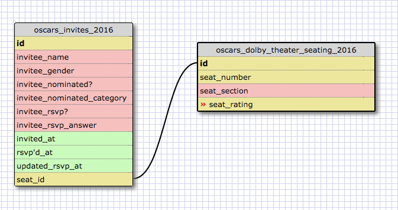

8.5 More Schemas

RELEASE 2: Create a one-to-one schema

My schema has two databases, one with the invitees to the 2016 oscars (with seat assignments) and one with the seat availability in the Dolby Theater for the same event. The relationship between invitee seat assignment and the seat id in the theater is one-to-one because, for the Oscars event, there will only be one person per seat.

RELEASE 4: Many to many / Refactor

RELEASE 6: Reflect
What is a one-to-one database? -- A one-to-one database is a database that connects two sets of data that have ids that perfectly match one-to-one to each other

When would you use a one-to-one database? (Think generally, not in terms of the example you created). -- you'd use a one-to-one database if the items across the databases being match exactly matched one-to-one

What is a many-to-many database? -- This is a database that connects items that can be connected to / match a bunch of different items and don't perfectly line up one-to-one

When would you use a many-to-many database? (Think generally, not in terms of the example you created). -- you'd use a many-to-many database when the items you're connected don't exactly match one-to-one

What is confusing about database schemas? What makes sense? -- I think databases so far make a lot of sense (nothing is confusing yet) ... I know this can change easily once we actually start working with many huge databases at once.

